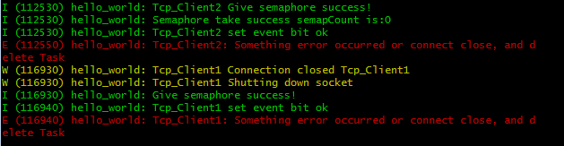

# TCP Server example
	note : If display is garbled, maybe your encoding is not GBK
  ESP32通过STA模式连接路由器(smartconfig方式连接)后开启TCP Server 最多可允许 2 个Client 连接成功并通信，可以 listen 队列中挂起一个连接队列
被挂起的队列不同的调试助手会有不一样的反馈，有的会显示连接成功，并在断开已被允许的 2 个Client后accpet允许连接 后创建任务处理通信。

# 你需要做哪些准备工作？
  首先你必须已安装了乐鑫的IDF和相应的工具链等。

  根据[官方链接](https://docs.espressif.com/projects/esp-idf/zh_CN/latest/get-started/index.html#get-started-step-by-step)中 **设置工具链**，
下载对应的 toolchain. 建议看完官网上的九步。

  本例程是用 eclipseIDE 来编写的，根据[Eclipse IDE 的创建和烧录指南](https://docs.espressif.com/projects/esp-idf/zh_CN/latest/get-started/eclipse-setup.html)
指示的步骤来安装和配置。 eclipse可以方便的编写和烧录程序。但观察日志输出建议还是通过工具链  $ make monitor 来观察，更直观！

  当然你最好得有一块乐鑫 esp32的开发板，至少你得有个esp32的模块。此例程在 ESP32-MeshKit-Sense 上运行，但在其它的ESP32环境中应该也可以正常运行的，这里是用
ESP-Prog烧录的

# 如何让该例程运行起来
	1.编译：你可以通过工具链 'cd' 到相应目录后 make all   你也可以通过 eclipse 导入工程再进行相应的配置后 右击工程目录 Build project.
	2.烧录：你可以通过工具链 'cd' 到相应目录后 make flash 你也可以通过 eclipse 右击工程目录 Build Target -> Create -> 在Target name中填入 'flash' 点击 'OK'后
	你可以直接按Shift+F9 来烧录程序
	3.调试：你可以通过网上下载“串口调试助手” 手机上也可以下载对应版本的“串口调试助手”可以开启多个TCP Client来连接到我们的TCP Server 
	这里需要注意的是我们TCP Server的IP地址是连接路由器后分配的。在日志中 hello_world: GOT IP :172.27.35.26 可看到IP地址 此地址也是我们TCP Server的IP地址 端口固定是7681
	4.日志：你可以通过工具链 'make flash monitor '来下载并在下载成功后自动开启日志。如果已通过eclipse Shift+F9下载 可直接 'make monitor'	

# 程序的流程
  本例程做得比较粗糙有一些都是直接从 esp-idf/examples中复制过来的
  
	app_main 初始化一些东西 执行后会返回delte_task();如果你不希望删除默认任务app_main中不可返回 此任务的堆栈大小可以 make menuconifg相应位置里更改
		|
		|
	调用wifi_init_sta 初始化wifi 判断是否需要smartconfig联网  在回调函数中如果多次连接失败也会开启smartconifg
		|
		|
	联网 got ip 后创建一个socket
		|
		|
	bind 这个socket到 7681 端口
		|
		|
	开启listen监听监听此设备上的 7681 端口 这里注意listen (int socket, int n) 第一个参数是我们创建的套接字描述符第二个参数代表可挂机的队列个数超过了后客户端连接返回失败
		|
		|
	如果还有任务可建就可以 accpet listen队列 注意这里也会返回一个套接字描述符，注意此返回的和listen参数描述符是有区别的 
	此返回的套接字描述符是对应的相应的TCP连接我们要通过这个描述符出通信
	
	到这里的简要描述就完成了，详细的描述在代码里有。

//以下部分代码开启keepAlive客户端意外掉线既自动关闭对应的连接
	int keepAlive = 1; // 开启keepalive属性

	int keepIdle = 20; // 如该连接在60秒内没有任何数据往来,则进行探测

	int keepInterval = 5; // 探测时发包的时间间隔为5 秒

	int keepCount = 3; // 探测尝试的次数.如果第1次探测包就收到响应了,则后2次的不再发.

	setsockopt(remoteInfo.sock,SOL_SOCKET,SO_KEEPALIVE,	(void *)&keepAlive,		sizeof(keepAlive));
	setsockopt(remoteInfo.sock,IPPROTO_TCP,TCP_KEEPIDLE,	(void *)&keepIdle,		sizeof(keepIdle));
	setsockopt(remoteInfo.sock,IPPROTO_TCP,TCP_KEEPINTVL,(void *)&keepInterval, 	sizeof(keepInterval));
	setsockopt(remoteInfo.sock,IPPROTO_TCP,TCP_KEEPCNT,	(void *)&keepCount, 	sizeof(keepCount));
# 日志如下图所示

TCP客户端连接进来并收到客户端发来的消息

TCP客户端断开连接

需要注意的事项：
	1.不同的调试助手可能有些操作不会相同。listen可以最多挂起一个没有被accpet的连接队列，当你有两个客户端连接上后 再连接第三个的时候可能会出现两种状况
　　Ⅰ:助手显示连接成功 且可以发送消息 此时的连接是被listen队列所维护但未被accpet接受处于挂起态，当断开一个Client释放资源被accpet后仍可读出挂起时收到的数据
　　Ⅱ:助手显示 连接操作成功，但是连接动作失败 不能发送消息